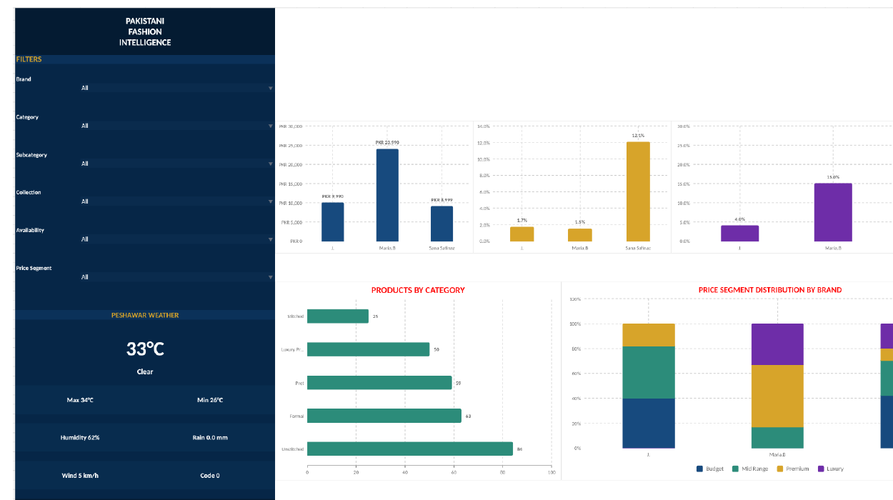

# Pakistani Fashion Intelligence

## Fashion Brand Competitive Price Analytics

A portfolio data analytics project comparing the pricing, discount activity, product mix, availability, and competitive positioning of **J.**, **Maria.B**, and **Sana Safinaz**.

I built the project as one complete workflow: **web scraping -> Python data cleaning -> PostgreSQL analysis -> Open-Meteo weather context -> interactive Excel dashboard -> business recommendations**.



## Project Snapshot

| Metric | Result |
|---|---:|
| Brands analyzed | 3 |
| Products collected | 281 |
| Main categories | 5 |
| Overall median price | PKR 12,990 |
| Average discount | 4.62% |
| Products on sale | 13.88% |
| Region used for weather context | Peshawar, Pakistan |

## Tools & Technologies

- **Python / Jupyter Notebook** - web scraping, cleaning, feature engineering, and API work
- **Pandas & NumPy** - data preparation and calculations
- **Requests & BeautifulSoup** - product data collection from official brand websites
- **PostgreSQL** - structured analysis, aggregation, ranking, CTEs, and window functions
- **Open-Meteo API** - current and seasonal weather context for Peshawar
- **Microsoft Excel** - interactive dashboard, filters, KPI cards, and charts

## Project Workflow

```text
Official Brand Websites
        |
        v
Web Scraping (Python)
        |
        v
Raw Product Dataset
        |
        v
Data Cleaning + Feature Engineering
        |
        v
Processed Dataset
        |
        +--------------------+
        |                    |
        v                    v
PostgreSQL Analysis     Open-Meteo API
        |                    |
        +---------+----------+
                  |
                  v
        Interactive Excel Dashboard
                  |
                  v
          Business Insights
```

## Repository Files

| File | Purpose |
|---|---|
| `01_Fashion_Web_Scraping_Aqib_Hanif.ipynb` | Collects product information from the selected official fashion websites |
| `01_raw_fashion_products.csv` | Raw web-scraped product dataset |
| `02_Data_Cleaning_Feature_Engineering_Aqib_Hanif.ipynb` | Cleans data and creates analytical features |
| `02_processed_fashion_products.csv` | Final processed dataset used for analysis |
| `03_PostgreSQL_Analysis_Aqib_Hanif.sql` | PostgreSQL database setup, quality checks, KPIs, business questions, rankings, views, and indexes |
| `04_Peshawar_Weather_API_Aqib_Hanif.ipynb` | Gets Peshawar current and seasonal weather using Open-Meteo |
| `04_current_peshawar_weather.csv` | Current weather output |
| `04_peshawar_seasonal_context.csv` | Seasonal weather context output |
| `05_Pakistani_Fashion_Intelligence_Dashboard_Aqib_Hanif.xlsx` | Final interactive Excel dashboard |
| `06_Project_Report_Aqib_Hanif.pdf` | Complete project report |
| `07_Project_Presentation_Aqib_Hanif.pptx` | Final presentation |

## Main Analytical Questions

1. Which brand has the lowest median price?
2. Which brand has the highest average discount?
3. What percentage of each brand's products are on sale?
4. Which categories contain the most products?
5. How does product mix differ by brand and category?
6. How are products distributed across Budget, Mid Range, Premium, and Luxury price segments?
7. Which products provide the highest savings?
8. How do the brands rank using the Brand Intelligence Score?

## Key Findings

- **Maria.B** has the highest median price at **PKR 23,990**, showing the strongest premium positioning in this sample.
- **J.** has a median price of **PKR 9,990**.
- **Sana Safinaz** has a median price of **PKR 8,999** and the highest average discount at **12.07%**.
- **Unstitched** is the largest category in the product sample.
- **Sana Safinaz** achieved the highest Brand Intelligence Score at **81.18**.

## Brand Intelligence Score

I combined four measures into one score out of 100:

- Price competitiveness - **30%**
- Discount strategy - **25%**
- Product variety - **25%**
- Availability - **20%**

| Brand | Score |
|---|---:|
| Sana Safinaz | 81.18 |
| J. | 65.28 |
| Maria.B | 45.32 |

## Dashboard

The Excel dashboard includes interactive filters for:

- Brand
- Category
- Subcategory
- Collection
- Availability
- Price Segment

It also includes KPI cards, price comparisons, discount analysis, products by category, price-segment distribution, and Peshawar weather context.

> Weather is included as regional and seasonal context only. It is not used to claim that weather directly caused fashion prices.

## How to Run the Project

For the easiest setup, keep all project files in the repository root because the notebooks use simple relative file paths.

```bash
pip install -r requirements.txt
jupyter notebook
```

Run the notebooks in this order:

```text
1. 01_Fashion_Web_Scraping_Aqib_Hanif.ipynb
2. 02_Data_Cleaning_Feature_Engineering_Aqib_Hanif.ipynb
3. 03_PostgreSQL_Analysis_Aqib_Hanif.sql
4. 04_Peshawar_Weather_API_Aqib_Hanif.ipynb
5. Open 05_Pakistani_Fashion_Intelligence_Dashboard_Aqib_Hanif.xlsx
```

More detailed instructions are available in [`QUICK_START.md`](QUICK_START.md).

## Academic Context

**Prepared by:** Aqib Hanif  
**Project:** Fashion Brand Competitive Price Analytics  
**Program:** IBM Data Analyst Professional Certificate - NAVTTC  
**Institute:** Arfa Karim Incubation Center, Peshawar  
**Assigned by:** Mam Sumayyea Salahuddin

## Note

Product prices and availability can change over time. The included datasets represent the project snapshot used for this analysis.
